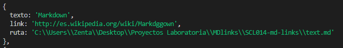
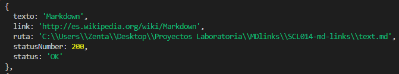
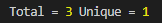
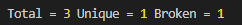

# Markdown Links

## 1. Preámbulo

[Markdown](https://es.wikipedia.org/wiki/Markdown) es un lenguaje de marcado
ligero muy popular entre developers. Es usado en muchísimas plataformas que
manejan texto plano (GitHub, foros, blogs, ...), y es muy común
encontrar varios archivos en ese formato en cualquier tipo de repositorio.

Estos archivos `Markdown` normalmente contienen _links_ (vínculos/ligas) que
muchas veces están rotos o ya no son válidos y eso perjudica mucho el valor de
la información que se quiere compartir.

Md.links es una herramienta que lee y analiza archivos en formato `Markdown`, verifica los links contenidos y reporta estadísticas sobre la cantidad de links encontrados y su estado.

## 2. Instalación

Se puede instalar a través del comando:

`npm i md-links-gvillacura`

Para instalar globalmente:

`npm i --g md-links-gvillacura`

## 3. Uso

### CLI (Command Line Interface - Interfaz de Línea de Comando)

El ejecutable de la aplicación puede usarse de la siguiente
manera a través de la terminal:

`md-links <path-to-file>`

Esta opción analiza el archivo Markdown e imprime los links encontrados, junto con la ruta del archivo donde aparece y el texto que hay dentro del link.

Por ejemplo:

`md-links text.md`

Arrojará:



También puede recibir opciones ejecutandolo de la siguiente manera :

`md-links <path-to-file> [options]`

- Ejemplo opción 1:

La opción --validate, verifica si el link funciona o no.

`md-links text.md --validate`

Arrojará:



- Ejemplo opción 2:

Si pasamos la opción --stats el resultado será estadísticas básicas sobre los links, indicando la cantidad total de links y cuantos de estos son únicos.

`md-links text.md --stats`

Arrojará:



- Ejemplo opción 3:

Al combinar --stats y --validate se obtienen estadísticas que necesiten de los resultados de la validación.

`md-links text.md --stats --validate`
o
`md-links text.md --validate --stats`

Arrojará:



### Uso de módulo

Para devolver el arreglo de objetos con los links encontrados, su ruta y el archivo que los contiene, se debe usar de la siguiente forma:

```js
const mdLinks = require("md-links");

mdLinks("text.md")
  .then((links) => {
    console.log(links);
  })
  .catch(console.error);
```

Y para usar la opción `--validate`:

```js
const mdLinks = require("md-links");

mdLinks("text.md", { validate: true })
  .then((links) => {
    console.log(links);
  })
  .catch(console.error);
```
